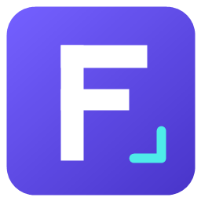

# FrameForge



An independent screen capture and annotation app under the **MIT license**. **Windows 0.2.6** is available now, with **macOS and Linux 0.3.0-preview.1** packages.

Capture a region, window, desktop, or scrolling area; annotate images; record video; and extract text locally with Windows OCR. FrameForge is an independently developed project.

## Run the app

Download **[FrameForge 0.2.6 for Windows](https://github.com/metalshanked/FrameForge/releases/tag/v0.2.6)**:

- **[Windows installer (recommended)](https://github.com/metalshanked/FrameForge/releases/download/v0.2.6/FrameForge-Setup-0.2.6.exe)** — installs for your Windows account, creates Start-menu shortcuts, and includes an uninstaller. Desktop and sign-in shortcuts are optional. Choose the installation directory during setup.
- **[Portable EXE](https://github.com/metalshanked/FrameForge/releases/download/v0.2.6/FrameForge-Portable-0.2.6.exe)** — run directly without installing the app; no separate .NET installation is needed.
- **[SHA256 checksums](https://github.com/metalshanked/FrameForge/releases/download/v0.2.6/SHA256SUMS.txt)** — verify the downloaded files.

Dependency licenses are available inside **Preferences → Open-source licenses**. Locally built packages are written to `dist/`.

Requires Windows 10 version 2004 or later / Windows 11, x64, and an interactive desktop. This early release is unsigned.

The portable EXE contains the .NET runtime and app dependencies. Native runtime files are unpacked to a temporary cache when it runs. Captures and settings are stored in `%LOCALAPPDATA%\FrameForge`; "portable" describes distribution, not a completely self-contained data folder.

Recording, trimming, and GIF export need a separately installed **FFmpeg**. Set `FRAMEFORGE_FFMPEG` to the full path of `ffmpeg.exe`, put it on PATH, or place it in a `tools` folder beside the app. FFmpeg is not bundled. See [FFmpeg](https://ffmpeg.org/download.html).

## Cross-platform desktop preview

A separate **0.3.0-preview.1** desktop edition is available for macOS (Apple Silicon and Intel), Linux (x64 and ARM64), and Windows. It includes a shared editor with annotation resizing, native/portal screenshots, clipboard support, automatic and manual scrolling, native Mac/Linux recording with audio and pause/resume, offline OCR, recoverable capture deletion, and configurable shortcuts.

Download the **[macOS and Linux preview release](https://github.com/metalshanked/FrameForge/releases/tag/v0.3.0-preview.1)**:

| Platform | Installer |
|---|---|
| macOS 14+, Apple Silicon | [Apple Silicon DMG](https://github.com/metalshanked/FrameForge/releases/download/v0.3.0-preview.1/FrameForge-Desktop-0.3.0-preview.1-osx-arm64.dmg) |
| macOS 14+, Intel | [Intel DMG](https://github.com/metalshanked/FrameForge/releases/download/v0.3.0-preview.1/FrameForge-Desktop-0.3.0-preview.1-osx-x64.dmg) |
| Debian/Ubuntu, x64 | [x64 Debian package](https://github.com/metalshanked/FrameForge/releases/download/v0.3.0-preview.1/FrameForge-Desktop-0.3.0-preview.1-linux-x64.deb) |
| Debian/Ubuntu, ARM64 | [ARM64 Debian package](https://github.com/metalshanked/FrameForge/releases/download/v0.3.0-preview.1/FrameForge-Desktop-0.3.0-preview.1-linux-arm64.deb) |

Portable archives, an experimental Windows desktop port, [checksums](https://github.com/metalshanked/FrameForge/releases/download/v0.3.0-preview.1/SHA256SUMS.txt), and build provenance are included on the release page. The .NET runtime is bundled.

**These are preview packages.** Mac builds are ad-hoc signed and not notarized; updating the app can require renewed screen-capture permission. Linux needs a compatible desktop portal, and native desktop capture has not been fully validated in GNOME/KDE. WSLg testing does not establish full Linux capture support. The native Windows installer above remains the recommended Windows edition.

See the **[preview guide](docs/CROSS-PLATFORM.md)** for installation, dependencies, and feature coverage, and the **[verification report](docs/TEST-REPORT-DESKTOP-PREVIEW.md)** for completed checks and remaining acceptance work.

## Everyday use

1. Open FrameForge and press **Ctrl + the backtick/tilde key** (the physical key, without Shift) to capture a region.
2. Drag a selection. The border and pixel dimensions show what will be captured; **Escape** cancels.
3. A completed screenshot opens in the editor and is automatically copied to the clipboard. After annotating, use **Copy image** to copy the edited version.
4. Close the editor to leave FrameForge running in the system tray. Double-click its purple F icon to reopen it. Windows may place it in the hidden-icons overflow.
5. Use **Preferences** to change close-to-tray behavior or enable **Start FrameForge when I sign in to Windows**. Use **Exit FrameForge** in the sidebar or tray menu to quit completely.

**Shortcuts…** in the fixed sidebar footer lets you choose your own capture combinations. Shortcuts work while the app is running, including in the tray. Opening the app again restores the existing instance.

The editor includes arrows, shapes, pen, text, callouts, highlights, numbered steps, blur, pixelation, opaque redaction, crop, resize, rotate, undo/redo, image export, and editable `.ffg` projects. See the [user guide](docs/USER-GUIDE.md) for capture, scrolling, recording, OCR, and shortcut details.

**Open capture folder** opens your saved screenshots, editable projects, and recordings in Windows File Explorer. Search recent captures by title; use the × button to clear a search. Sidebars use thin overlay scrollbars that appear on hover or keyboard focus. Flat buttons provide hover, press, and keyboard-focus feedback, with consistent control heights and spacing.

## Build from source

Install the .NET 8 SDK on Windows, then run from the repository root:

```powershell
.\scripts\build.ps1
.\scripts\test.ps1
.\scripts\build.ps1 -SingleFile
```

The normal development build goes to `artifacts/app`; the single-file build goes to `dist/portable`. NuGet access is needed for the first restore. Close the running build before replacing its executable.

For the installer, install NSIS 3.x and run:

```powershell
.\scripts\package.ps1 -MakeNsis 'C:\Program Files (x86)\NSIS\makensis.exe'
```

Check the installer with `scripts/test-package.ps1`; it uses isolated installation files and test registry entries.

The scripts can also use a task-local SDK and NSIS compiler under `.local`; those development tools are ignored by Git and are not required in a source checkout.

Run the desktop integration checks with:

```powershell
.\scripts\test.ps1 -Ui -Executable .\dist\portable\FrameForge.exe
```

GUI tests require an unlocked Windows desktop. Activate the test editor if Windows opens it in the background. The tests use an isolated data directory, replace the clipboard with test images, and require FFmpeg for video checks.

## Repository layout

| Folder | Contents |
|---|---|
| `src/FrameForge` | WPF application and regression checks |
| `src/FrameForge.Core` | Portable document, image processing, and stitching |
| `src/FrameForge.Desktop` | Avalonia cross-platform desktop preview |
| `tests/FrameForge.Core.Checks` | Portable regression checks |
| `assets` | Original SVG, PNG, and multiresolution ICO |
| `tools/IconBuilder` | Reproducible icon generator |
| `scripts` | Build, test, package, and release-draft scripts |
| `releases` | Pinned build provenance for preview packages |
| `packaging` | NSIS installer source |
| `docs` | User guide and verification notes |
| `licenses` | Dependency licenses |
| `dist`, `artifacts`, `.local` | Ignored release output, test/build output, and local tools |

## Status and limits

This is an early usable implementation; feature coverage and production readiness are still evolving. Scrolling capture currently works downward and relies on stable overlapping content. Protected content, minimized windows, and the secure desktop cannot be captured. Mixed-DPI/HDR displays, webcam hardware, microphone quality, long recordings, and audio/video synchronization need broader hardware testing. Automatic updates and cloud sharing are not implemented.

Use opaque **Redact** and export a flattened image when concealing content. Editable projects retain the original image. See [verification notes](docs/TEST-REPORT.md) for checks actually performed.

The repository contains source, documentation, original assets, and packaging scripts. Generated binaries, local tools, caches, and captures are excluded from source control.

## Contributing and license

See [CONTRIBUTING.md](CONTRIBUTING.md), [MIT license](LICENSE), and [third-party notices](THIRD-PARTY-NOTICES.md). FFmpeg is an external dependency with licensing determined by the build you install.